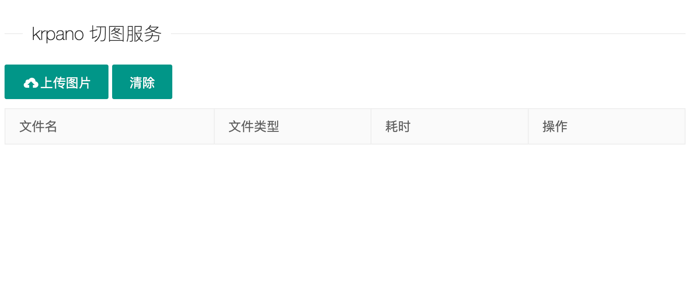
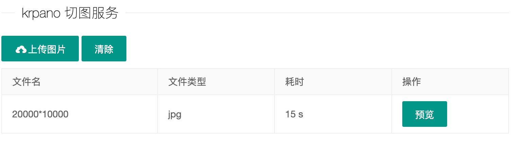
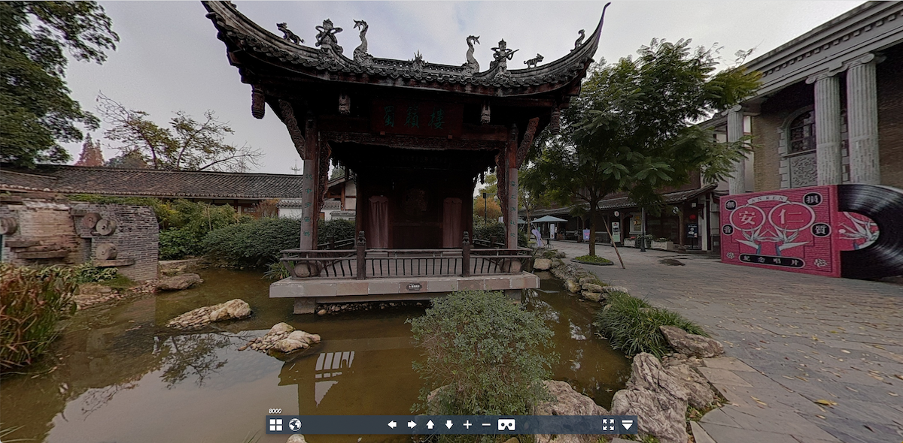

# krpano-cut-server

仿 krpano 多分辨率切图服务，自己实现切图更方便掌控各个环节的问题，[项目解读参考](https://juejin.cn/post/7241778027876679741)

使用需要依赖`node-canvas`

```shell
npm install canvas
```

但是在安装过程会出现错误，
对于不同的系统需要使用不同的工具安装对应的依赖包：

Mac Os 中 可以使用 Homebrew 执行命令 `brew install pkg-config cairo pango libpng jpeg giflib librsvg`

Ubuntu 中 可以执行命令 `sudo apt-get install build-essential libcairo2-dev libpango1.0-dev libjpeg-dev libgif-dev librsvg2-dev`

CentOs 中 可以执行命令 `sudo yum install gcc-c++ cairo-devel pango-devel libjpeg-turbo-devel giflib-devel`

Windows 中 可以参考这个[文档](https://github.com/Automattic/node-canvas/wiki/Installation:-Windows)

具体方案不再一一列举，请参考[官方文档](https://github.com/Automattic/node-canvas#readme)

也可以使用`docker`镜像，有配置好的镜像环境拿来即用，比较方便

启动方式

```shell
npm run dev
```

然后访问：localhost:8080，效果如下





点击预览可查看切出来的多分辨率漫游作品

# sphere

在 krpano 中，多分辨率瓦图主要有两种类型：cube 和 sphere。

当前例子使用的是 sphere 方式，后续有时间会扩展 cube 方式

# 想法

后续可以进行的优化和扩展：

- 多进程
- 加入任务队列
- 瓦片图合并为全景图
- 立方体 cube 瓦图
- 作品离线包功能
